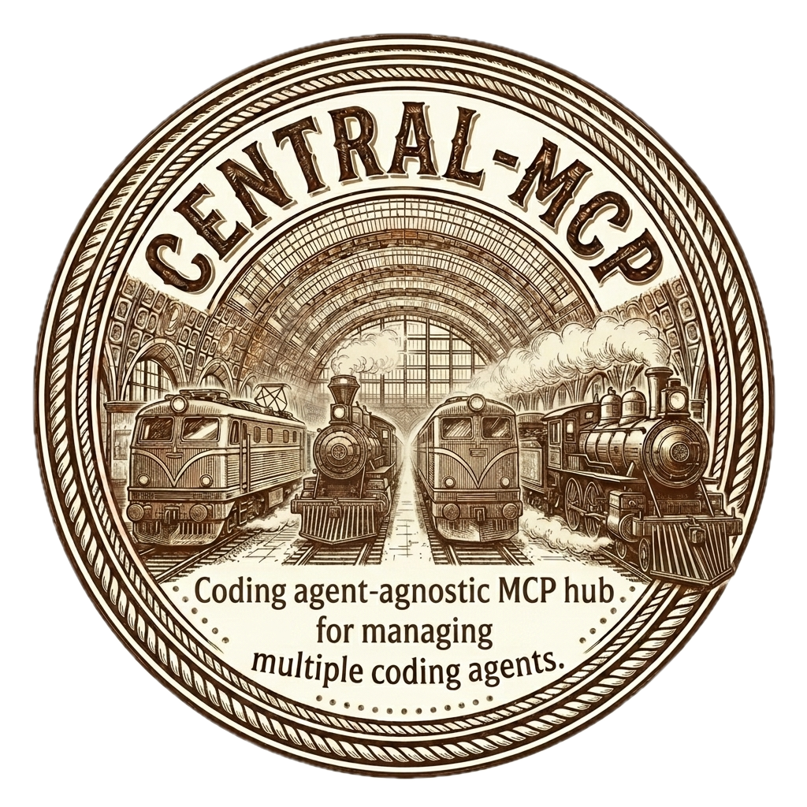

# central-mcp

<p align="center">
  
</p>

**여러 코딩 에이전트를 하나의 허브에서 디스패치하는, 오케스트레이터 비종속 MCP 서버.**

> **멈추지 마세요. 프로젝트마다 에이전트를 병렬로 돌려 처리량을 10배, 100배로 키우세요.**

하나의 MCP 서버로 어떤 MCP 클라이언트(Claude Code, Codex CLI, Gemini CLI, opencode 등)든 여러 코딩 에이전트 프로젝트의 컨트롤 플레인이 됩니다. 자연어로 요청하면 오케스트레이터가 해당 프로젝트의 에이전트에게 작업을 보내고, 논블로킹으로 결과를 비동기 보고합니다.

## 왜 필요한가

여러 코딩 에이전트를 쓰고 있다면, 각각 별도의 터미널·세션·로그를 갖고 있을 것입니다. 사이를 오가는 건 마찰이고, *어디서 뭐가 응답했는지* 한눈에 보이지 않습니다.

`central-mcp`는 하나의 허브를 제공합니다:

- **디스패치** — 프로젝트별 에이전트에 프롬프트를 보내고 MCP를 통해 응답 수신
- **병렬 작업** — 여러 프로젝트에 동시 디스패치하고 대화를 계속
- **관리** — `add_project` / `remove_project`로 레지스트리 편집
- **오케스트레이터 비종속** — 어떤 MCP 클라이언트든 오케스트레이터 가능

모든 디스패치는 프로젝트 cwd에서 새 서브프로세스를 띄우는 방식(예: `claude -p "..." --continue`). 장기 프로세스 관리 불필요, 화면 스크래핑 없음, 크리티컬 패스에 tmux 의존 없음.

## 설계 원칙

1. **오케스트레이터 비종속.** MCP 도구가 정규 인터페이스. 어떤 MCP 클라이언트든 오케스트레이터 가능.
2. **논블로킹 디스패치.** `dispatch`는 `dispatch_id`를 <100ms에 반환. 결과는 비동기로 도착. 대화가 멈추지 않음.
3. **디스패치 라우터 프리앰블.** 오케스트레이터는 순수 라우터로 동작 — 프로젝트명 파싱, `dispatch` 호출, 다음 요청. LLM 추론 지연 ~1-2초.
4. **파일 기반 상태.** `registry.yaml`이 유일한 진실의 원천.

## 상태

[PyPI](https://pypi.org/project/central-mcp/)에서 설치 가능합니다.

## 빠른 시작

```bash
# uv가 없다면 먼저 설치 (https://docs.astral.sh/uv/)
curl -LsSf https://astral.sh/uv/install.sh | sh
```

> pip도 사용 가능합니다: `pip install central-mcp`

(선택적 관찰 레이어를 쓰려면 `tmux`도.)

```bash
# 1. 설치
uv tool install central-mcp

# 2. 빈 레지스트리 생성 (~/.central-mcp/registry.yaml)
central-mcp init

# 3. MCP 클라이언트에 central-mcp 등록 — 클라이언트당 1회
central-mcp install claude    # Claude Code MCP 설정에 추가
central-mcp install codex     # ~/.codex/config.toml 패치
central-mcp install gemini    # ~/.gemini/settings.json 패치
central-mcp install opencode  # ~/.config/opencode/opencode.json 패치

# 4. 오케스트레이터 기동
central-mcp run
```

오케스트레이터 세션 안에서 자연어로:

- *"~/Projects/my-app을 허브에 추가해줘, agent=claude."*
- *"내 프로젝트 목록은?"*
- *"my-app에 보내줘: auth 모듈에 에러 핸들링 추가해."*
- *"gluecut-dawg에도 보내줘: 프로젝트 구조 요약해."*

오케스트레이터는 `dispatch`를 호출하고 **즉시 대화를 이어갑니다** — 기다릴 필요 없음. 결과는 세 가지 경로로 도착:

- **피기백 (자동):** 모든 MCP 도구 응답에 완료된 dispatch 결과가 `completed_dispatches` 배열로 포함.
- **백그라운드 폴링 (최선):** 서브에이전트가 3초마다 `check_dispatch`를 폴링하고 완료 시 자동 보고.
- **사용자 질문 (100% 신뢰):** "결과는?" / "업데이트 있어?" 하면 즉시 답변.

여러 디스패치가 병렬로 실행됩니다.

## MCP 도구

`central-mcp`는 `central` 서버명으로 11개 도구를 노출합니다:

| 도구 | 블로킹? | 용도 |
|---|---|---|
| `list_projects` | sync | 레지스트리 열거. |
| `project_status` | sync | 프로젝트 메타데이터. |
| `dispatch` | **<100ms** | 프로젝트 에이전트에 프롬프트 전송. 일회성 에이전트 오버라이드 및 fallback 체인 지원. `dispatch_id` 즉시 반환. |
| `check_dispatch` | sync | 디스패치 폴링 — `running` / `complete` / `error` + 출력. |
| `list_dispatches` | sync | 모든 활성 + 최근 완료 디스패치. |
| `cancel_dispatch` | sync | 실행 중인 디스패치 중단. |
| `dispatch_history` | sync | **특정 프로젝트**의 최근 N개 디스패치 이력 (해당 프로젝트 jsonl 로그 기반). |
| `orchestration_history` | sync | 포트폴리오 전체 스냅샷 — 진행 중인 디스패치 + 프로젝트 간 최근 milestone + 프로젝트별 집계. "전반적으로 어떻게 돌아가?" 한 번에. |
| `add_project` | sync | 새 프로젝트 등록. 에이전트 이름 검증. Codex 디렉토리 자동 trust. |
| `update_project` | sync | 기존 프로젝트의 agent / description / tags / bypass / fallback 변경. |
| `remove_project` | sync | 프로젝트 등록 해제. |

### 디스패치 동작 방식

```
dispatch("my-app", "auth에 에러 핸들링 추가")
  → subprocess.Popen(["claude", "-p", "...", "--continue"], cwd="~/Projects/my-app")
  → {dispatch_id: "a1b2c3d4"} 즉시 반환 (<100ms)
  → 백그라운드 스레드가 프로세스 종료 시 stdout 캡처
  → check_dispatch("a1b2c3d4") → {status: "complete", output: "...", duration_sec: 45}
```

### 지원 에이전트

| 에이전트 | 비인터랙티브 호출 | bypass 플래그 |
|---|---|---|
| `claude` | `claude -p "<프롬프트>" --continue` | `--dangerously-skip-permissions` |
| `codex` | `codex exec "<프롬프트>"` | `--dangerously-bypass-approvals-and-sandbox` |
| `gemini` | `gemini -p "<프롬프트>"` | `--yolo` |
| `droid` | `droid exec "<프롬프트>"` | `--skip-permissions-unsafe` |
| `opencode` | `opencode run "<프롬프트>" --continue` | `--dangerously-skip-permissions` |

에이전트 이름은 등록 시점에 검증됩니다 — `cursor-agent` 같은 오타는 dispatch 시점이 아니라 즉시 잡힙니다.

### 프로젝트 에이전트 변경

프로젝트에 등록된 에이전트를 언제든 변경할 수 있습니다 — 특정 코드베이스가 다른 CLI와 더 잘 맞는 경우 유용:

```
update_project(name="my-app", agent="codex")
```

`update_project`는 `description`, `tags`, `bypass`, `fallback` 도 받습니다 — 생략된 필드는 그대로 유지. `codex`로 전환하면 프로젝트 디렉토리가 `~/.codex/config.toml` trust 리스트에 자동 등록됩니다.

### 일회성 에이전트 오버라이드

레지스트리를 변경하지 않고 *한 번만* 다른 에이전트로 작업을 보내고 싶을 때 — 예를 들어 디자인에 특화된 에이전트에게 디자인 작업만 보내고 프로젝트는 원래 에이전트 유지:

```
dispatch(name="my-app", prompt="...", agent="codex")
```

레지스트리는 유지됩니다. `agent=` 없이 다음 dispatch는 다시 저장된 에이전트로.

### 실패 시 fallback 체인

주 에이전트가 non-zero로 종료될 때 (rate limit, 토큰 한도, 크래시), central-mcp가 백업 에이전트로 자동 재시도:

```
# 일회성 (저장 안됨):
dispatch(name="my-app", prompt="...", fallback=["codex", "gemini"])

# 이 프로젝트의 기본값으로 저장:
update_project(name="my-app", fallback=["codex", "gemini"])
```

결과에는 실제로 응답을 생성한 에이전트(`agent_used`), fallback이 발동되었는지(`fallback_used`), 그리고 모든 시도의 목록이 포함됩니다. 타임아웃은 재시도되지 *않습니다* — 멈춘 에이전트 때문에 전체 체인을 소모하기보다 사용자에게 바로 보여주는 것이 낫기 때문.

저장된 fallback 체인을 일회성으로 비활성화하려면 `fallback=[]` 전달.

### Bypass 모드

대부분의 코딩 에이전트는 파일 수정·명령어 실행·패키지 설치 전에 "이거 해도 돼?"를 물어봅니다. 사람이 터미널 앞에 있으면 괜찮지만, central-mcp가 돌아가는 어느 경로에도 응답할 TTY가 없어서 **승인을 기다리며 영원히 멈출 수 있습니다**. **Bypass 모드**는 에이전트에게 스스로의 동작을 자동 승인하도록 지시해 작업을 멈추지 않고 진행시킵니다.

Bypass는 서로 다른 두 레이어가 있고, 각각 스택의 다른 층에 적용됩니다:

#### 1. 오케스트레이터 bypass — `central-mcp run` / `central-mcp tmux` / `central-mcp up`

**사용자가 직접 대화하는** 오케스트레이터 pane(Claude Code, Codex 등) 자체에 에이전트의 permission-bypass 플래그(`claude --dangerously-skip-permissions`, `codex --dangerously-bypass-approvals-and-sandbox` 등)를 적용합니다. **기본값: 켜짐**. 끄려면 `--no-bypass`:

```bash
central-mcp tmux --no-bypass     # 오케스트레이터가 승인 프롬프트를 띄움
central-mcp run --no-bypass
```

오케스트레이터 bypass가 **켜지면** 오케스트레이터가 기동 디렉토리(`~/.central-mcp`)에서 물어보지 않고 파일을 읽고 씁니다 — `CLAUDE.md`, scratch note, 허브 편집이 마찰 없이 진행됩니다. 이 설정은 dispatch로 보내는 프로젝트 에이전트에는 **영향을 주지 않습니다** (아래 별도 레이어).

#### 2. 프로젝트별 dispatch bypass — `dispatch(..., bypass=...)` / `registry.yaml`

특정 프로젝트의 cwd에서 한 번 spawn되는 에이전트에 적용되는 값입니다. 프로젝트 첫 dispatch에서 선택된 값이 `registry.yaml`에 저장되어 이후 재사용됩니다. **신규 프로젝트 기본값: `null` (한 번 물어봄)** — 첫 dispatch 시 central-mcp가 오케스트레이터에게 `bypass=true/false` 결정을 요청합니다. 언제든 덮어씌울 수 있음:

```
dispatch(name="my-app", prompt="…", bypass=true)   # 자동 승인, 설정 저장
dispatch(name="my-app", prompt="…", bypass=false)  # 프롬프트 노출, 설정 저장
update_project(name="my-app", bypass=true)         # dispatch 없이 값만 변경
```

프로젝트 bypass가 **꺼져 있으면** 안전한 읽기 전용 dispatch(질문 답변, 파일 읽기, 코드 설명)는 정상 동작. 권한 프롬프트가 뜨는 작업(파일 편집, 쉘 명령, 의존성 설치)은 타임아웃까지 hang — 오케스트레이터가 `bypass=true`로 재시도하거나, 별도 터미널에서 프로젝트 cwd에 들어가 에이전트를 인터랙티브로 띄워 직접 승인하도록 제안합니다.

> ### ⚠️ bypass는 강력합니다 — 본인 책임
>
> 어느 쪽 레이어든 bypass가 켜져 있으면 해당 에이전트는 **사용자 확인 없이** 파일 수정, 쉘 명령 실행, 패키지 설치, 네트워크 서비스 호출, 코드 push를 수행할 수 있습니다. 이게 멈춤 없는 오케스트레이션을 가능케 하지만, 잘못된 프롬프트·외부 프롬프트 인젝션·에이전트 hallucination이 실제 피해(테이블 drop, 강제 푸시, 파일 삭제, 자격증명 유출, 의도하지 않은 API 비용 등)로 이어질 수 있습니다.
>
> 차이점 정리:
> - **오케스트레이터 bypass**는 *허브 레벨* 에이전트가 `~/.central-mcp` 및 MCP 도구 호출 과정에서 할 수 있는 일을 제어합니다. 허브 디렉토리에 프로덕션 코드가 없으므로 실제 리스크는 상대적으로 낮지만, 그래도 읽기/쓰기는 자동.
> - **프로젝트 bypass**는 각 *프로젝트 레벨* 에이전트가 해당 프로젝트 cwd 안에서 할 수 있는 일을 제어합니다. 소스 코드 재작성, 빌드 실행, 브랜치 푸시가 일어나는 **고위험** 레이어.
>
> **다음에 해당하면 해당 레이어의 bypass를 꺼 주세요**:
> - 프로젝트(또는 `~/.central-mcp`)에 민감한 코드/비밀번호/프로덕션 데이터가 있음
> - 안전망이 될 커밋/푸시가 아직 준비되지 않음
> - 프롬프트를 꼼꼼히 확인하지 않았거나, 신뢰할 수 없는 소스의 작업을 위임
> - 에이전트가 실행할 명령을 매번 리뷰하고 싶음
>
> **면책**: central-mcp는 라우팅 레이어로서 에이전트가 어떤 작업을 수행하는지 감독하지 않습니다. 어느 레이어의 bypass든 그로 인해 발생한 dispatch의 범위·대상·결과에 대한 책임은 사용자 본인에게 있습니다. central-mcp 저자와 기여자는 bypass 사용으로 인한 데이터 손실·보안 침해·비용 발생·기타 피해에 대해 **어떤 책임도 지지 않습니다**. 스냅샷(git 커밋, 백업, 브랜치 보호), 최소 권한 자격증명, 오프라인/샌드박스 환경을 최대한 활용하세요.

### 디스패치 히스토리 (프로젝트별)

모든 dispatch는 `~/.central-mcp/logs/<project>/dispatch.jsonl`에 `start` / `output` / `complete` 이벤트를 append로 기록합니다. `dispatch_history`는 terminal 이벤트를 start와 merge해서 반환:

```
dispatch_history(name="my-app")          # my-app 최근 10개
dispatch_history(name="my-app", n=50)    # 최근 50개
```

포트폴리오 차원의 관찰은 `orchestration_history` (아래) 사용.

### 오케스트레이션 히스토리 (포트폴리오 뷰)

"전체적으로 어떻게 돌아가?"를 한 번의 호출로 답합니다. 전역 타임라인 `~/.central-mcp/timeline.jsonl` + 서버 메모리의 in-flight 테이블을 합쳐 반환:

```
orchestration_history()                  # 진행 중 + 전체 프로젝트 최근 20개 milestone
orchestration_history(n=100)             # 더 긴 이력
orchestration_history(window_minutes=60) # 최근 1시간 활동만
```

응답에는 `in_flight` (현재 실행 중), `recent` (최근 milestone), `per_project` (프로젝트별 dispatched/succeeded/failed/cancelled 카운트 + 최근 ts), 레지스트리 스냅샷이 포함됩니다. 오케스트레이터가 이 한 번의 호출로 복수 프로젝트 현황을 자연어로 요약할 수 있습니다.

### 성능 팁: 오케스트레이터에 빠른 모델 사용

오케스트레이터는 라우팅만 하므로 최상위 모델이 필요 없습니다:

| 오케스트레이터 클라이언트 | 팁 |
|---|---|
| Claude Code | `/model sonnet` — 턴당 ~1-2초 vs Opus ~5-8초 |
| Codex CLI | 경량 모델 사용 (예: `-spark` 변형) `/model` 또는 `config.toml`에서 설정 |
| Gemini CLI | 가능하면 Pro 대신 Flash 사용 |
| opencode | `-m provider/model` 또는 `opencode.json`에서 빠른 모델 선택 |

서브에이전트 모델은 독립적 — 각 `dispatch`는 프로젝트 에이전트의 기본 모델로 자체 프로세스를 생성합니다.

## CLI 레퍼런스

```
central-mcp                        # 인자 없음 → 오케스트레이터 기동 (`run`과 동일)
central-mcp run [--agent X] [--pick] [--bypass]  # 오케스트레이터 기동 (명시적)
central-mcp serve                  # stdio에서 MCP 서버 실행 (MCP 클라이언트가 사용)
central-mcp install CLIENT         # claude | codex | gemini | opencode에 등록
central-mcp alias [NAME]           # 짧은 이름 심링크 (기본: cmcp)
central-mcp unalias [NAME]
central-mcp init [PATH]            # registry.yaml 스캐폴드 (기본: ~/.central-mcp)
central-mcp add NAME PATH [--agent claude|codex|gemini|droid|opencode]
central-mcp remove NAME
central-mcp list                   # 한 줄씩 레지스트리 출력
central-mcp brief                  # 오케스트레이터용 마크다운 스냅샷
central-mcp up [--no-orchestrator] [--no-bypass] [--panes-per-window N]
                                   # 선택적 tmux 관찰 레이어 생성
central-mcp tmux [up과 동일 플래그]   # 세션이 없으면 생성 후 tmux로 attach
central-mcp down                   # 관찰 세션 종료
central-mcp watch NAME [--from-start]
                                   # 프로젝트의 dispatch 이벤트 실시간 스트리밍
central-mcp upgrade [--check]      # PyPI에서 최신 버전 확인 후 자동 업그레이드 (uv → pip fallback)
```

## 선택적 관찰 레이어

`central-mcp up`은 tmux 세션 `central`을 만듭니다:

- **Pane 0 — 오케스트레이터** (Claude Code / Codex / Gemini / opencode). `~/.central-mcp`에서 기동되어 허브의 `CLAUDE.md` / `AGENTS.md`를 읽음.
- **Pane 1…N — 프로젝트당 하나**. 각 pane은 `central-mcp watch <project>`를 실행해 해당 프로젝트의 dispatch 활동(프롬프트, 출력, exit code, duration)을 실시간 스트리밍.

윈도우 이름은 `cmcp-<N>` 형식. 오케스트레이터가 포함된 첫 윈도우는 `-hub` 접미사(`cmcp-1-hub`)가 붙어 한눈에 구분됩니다. `Ctrl+b n` / `Ctrl+b <숫자>`로 pane 전환. 레지스트리가 한 윈도우에 담기 어려운 규모면 `cmcp-2`, `cmcp-3`, … 윈도우가 자동 생성됩니다 — 각 윈도우당 `--panes-per-window`(기본 4) 개수까지.

```bash
central-mcp tmux                   # 원샷: 세션 없으면 생성, 바로 attach
central-mcp tmux --no-bypass       # bypass 끄고 오케스트레이터 기동
central-mcp tmux --no-orchestrator # watch pane만
central-mcp tmux --panes-per-window 6
central-mcp up                     # attach 없이 세션만 생성 (스크립트용)
central-mcp down                   # 세션 종료
```

Hub 윈도우(`cmcp-1-hub`)는 tmux의 `main-vertical` 레이아웃을 사용합니다 — 오케스트레이터 pane이 왼쪽에 두 칸 크기를 차지하고, 프로젝트 pane들이 오른쪽에 세로로 쌓입니다. 그래서 hub는 `panes_per_window − 1`개 pane(기본 3 — 오케스트레이터 + 프로젝트 2개)을 담고, 오버플로우 윈도우는 `panes_per_window`개 프로젝트를 그대로 담습니다. 모든 pane은 상단 border에 역할 이름이 표시되고, 오케스트레이터 border는 굵은 노란색으로 강조됩니다.

`central-mcp down`으로 종료해도 MCP 디스패치 경로는 이 레이어에 의존하지 않으므로 진행 중인 dispatch에 영향 없습니다. `watch`는 `~/.central-mcp/logs/<project>/dispatch.jsonl`을 읽기 전용으로 tail하는 구조라 어떤 터미널에서도 독립 실행 가능합니다.

## 레지스트리 경로 해결

3단계 캐스케이드:

1. `$CENTRAL_MCP_REGISTRY` (명시적 오버라이드)
2. cwd의 `./registry.yaml` (프로젝트별 오버라이드)
3. `$HOME/.central-mcp/registry.yaml` (글로벌 기본값)

레지스트리는 사용자별 상태입니다 — 커밋하지 마세요.

## 오케스트레이터 변경

```bash
central-mcp run --pick         # 피커 재실행, 새 선택 저장
central-mcp run --agent codex  # 1회성 오버라이드
$EDITOR ~/.central-mcp/config.toml
```

## 환경 변수

- `CENTRAL_MCP_HOME` — 사용자 상태 디렉토리 (기본: `~/.central-mcp`)
- `CENTRAL_MCP_REGISTRY` — 레지스트리 경로 오버라이드

## 개발

```bash
uv tool install --editable .
uv run --group dev pytest             # 141개 단위 테스트 (빠름, 실제 CLI 호출 없음)
uv run --group dev pytest -m live     # 20개 라이브 테스트 — 실제 에이전트 바이너리
                                      # (claude/codex/gemini/droid) 호출.
                                      # 해당 바이너리가 PATH에 없으면 자동 skip
```

## 라이선스

MIT.
